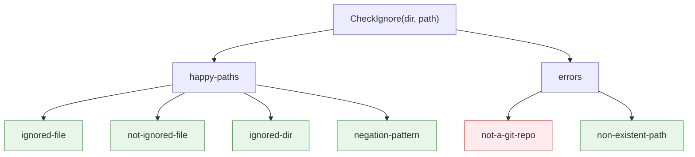

# CheckIgnore Test Case Tree

Run with:
```sh
doctest test ./ -v
```

## DOT Graph



## Text Tree

```
CheckIgnore(dir, path)
├── 🍃 ignored-file
├── 🍃 not-ignored-file
├── 🍃 ignored-dir
├── 🍃 negation-pattern
├── 🔴 not-a-git-repo
└── 🍃 non-existent-path
```

## Test Case Index

| # | Path | Preconditions | Expected |
|---|---|---|---|
| 1 | `ignored-file/` | `.gitignore`=`*.log`, `app.log` exists | `true` |
| 2 | `not-ignored-file/` | `.gitignore`=`*.log`, `main.go` exists | `false` |
| 3 | `ignored-dir/` | `.gitignore`=`build/`, `build/` exists with files | `true` |
| 4 | `negation-pattern/` | `.gitignore`=`*.o` then `!important.o`, `important.o` exists | `false` |
| 5 | `not-a-git-repo/` | `dir` is not a git repo | error |
| 6 | `non-existent-path/` | `.gitignore`=`*.log`, path `missing.log` does not exist | `false` |
