# GetOnDiskChangedFiles Test Case Tree

Run with:
```sh
go install github.com/xhd2015/doctest@latest

doctest test ./ -v
```

## DOT Graph

```mermaid
graph TD
    root["GetOnDiskChangedFiles(dir, opts...)"] --> nocompare["no-compare-with (git status)"]
    root --> withcompare["with-compare-with (DiffCommitFiles)"]
    root --> errors["errors"]

    nocompare --> resolve["resolvePathsToFiles = true"]
    nocompare --> noresolve["resolvePathsToFiles = false"]

    resolve --> hasdirs["has-dir-entries"]
    resolve --> onlyfiles["only-file-entries"]
    resolve --> noentries["no-entries"]

    hasdirs --> L1["no-gitignored"]:::test
    hasdirs --> L2["gitignored-file"]:::test
    hasdirs --> L3["gitignored-subdir"]:::test
    hasdirs --> L4["nested-gitignore"]:::test
    hasdirs --> L5["all-gitignored"]:::test
    hasdirs --> L6["dir-removed-on-disk"]:::test
    hasdirs --> L7["deep-nested-dir"]:::test

    onlyfiles --> L8["modified-unstaged"]:::test
    onlyfiles --> L9["modified-staged"]:::test
    onlyfiles --> L10["modified-both"]:::test
    onlyfiles --> L11["new-untracked"]:::test
    onlyfiles --> L12["newly-staged"]:::test
    onlyfiles --> L13["staged-rename"]:::test
    onlyfiles --> L14["staged-rename-edit"]:::test
    onlyfiles --> L15["untracked-rename"]:::test
    onlyfiles --> L16["type-change"]:::test
    onlyfiles --> L17["subdirectory-file"]:::test
    onlyfiles --> L18["mixed-file-types"]:::test

    noentries --> L19["clean-repo"]:::test
    noentries --> L20["only-deleted"]:::test

    noresolve --> L21["modified-unstaged-nr"]:::test
    noresolve --> L22["modified-staged-nr"]:::test
    noresolve --> L23["modified-both-nr"]:::test
    noresolve --> L24["new-untracked-nr"]:::test
    noresolve --> L25["newly-staged-nr"]:::test
    noresolve --> L26["staged-rename-nr"]:::test
    noresolve --> L27["staged-rename-edit-nr"]:::test
    noresolve --> L28["untracked-rename-nr"]:::test
    noresolve --> L29["untracked-dir-nr"]:::test
    noresolve --> L30["deleted-unstaged-nr"]:::test
    noresolve --> L31["deleted-staged-nr"]:::test
    noresolve --> L32["subdirectory-file-nr"]:::test
    noresolve --> L33["mixed-changes-nr"]:::test
    noresolve --> L34["clean-repo-nr"]:::test

    withcompare --> c_resolve["resolvePathsToFiles = true"]
    withcompare --> c_noresolve["resolvePathsToFiles = false"]
    withcompare --> c_ref["ref-type"]

    c_resolve --> untracked["has-untracked"]
    c_resolve --> c_new["has-new"]
    c_resolve --> c_mod["has-modified"]
    c_resolve --> c_ren["has-renamed"]
    c_resolve --> c_del["has-deleted"]
    c_resolve --> c_noch["no-changes"]

    untracked --> L35["untracked-file-cmp"]:::test
    untracked --> L36["untracked-dir-cmp"]:::test
    c_new --> L37["new-file-cmp"]:::test
    c_mod --> L38["modified-single-cmp"]:::test
    c_mod --> L39["modified-multiple-cmp"]:::test
    c_ren --> L40["rename-cmp"]:::test
    c_del --> L41["deleted-cmp"]:::test
    c_noch --> L42["clean-vs-head-cmp"]:::test
    c_noch --> L43["clean-vs-ancestor-cmp"]:::test

    c_noresolve --> L44["modified-noresolve-cmp"]:::test
    c_noresolve --> L45["untracked-file-nr-cmp"]:::test
    c_noresolve --> L46["new-file-nr-cmp"]:::test
    c_noresolve --> L47["rename-nr-cmp"]:::test
    c_noresolve --> L48["deleted-nr-cmp"]:::test
    c_noresolve --> L49["mixed-nr-cmp"]:::test
    c_noresolve --> L50["clean-vs-head-nr-cmp"]:::test
    c_noresolve --> L51["clean-between-commits-nr-cmp"]:::test

    c_ref --> L52["ref-head"]:::test
    c_ref --> L53["ref-ancestor"]:::test
    c_ref --> L54["ref-branch"]:::test
    c_ref --> L55["ref-tag"]:::test
    c_ref --> L56["ref-commit-hash"]:::test
    c_ref --> E1["ref-invalid"]:::error

    errors --> E2["not-a-git-repo"]:::error
    errors --> E3["dir-not-found"]:::error
    errors --> E4["git-command-failed"]:::error

    classDef test fill:#e8f5e9,stroke:#4caf50
    classDef error fill:#ffebee,stroke:#f44336
    classDef mode fill:#e1f5fe,stroke:#0288d1
    classDef decision fill:#fff9c4,stroke:#fbc02d
```



## Text Tree

```
GetOnDiskChangedFiles(dir, opts...)
│
├── [mode] no-compare-with
│   │
│   ├── [decision] resolvePathsToFiles = true
│   │   │
│   │   ├── [decision] has-dir-entries
│   │   │   ├── 🍃 no-gitignored
│   │   │   ├── 🍃 gitignored-file
│   │   │   ├── 🍃 gitignored-subdir
│   │   │   ├── 🍃 nested-gitignore
│   │   │   ├── 🍃 all-gitignored
│   │   │   ├── 🍃 dir-removed-on-disk
│   │   │   └── 🍃 deep-nested-dir
│   │   │
│   │   ├── [decision] only-file-entries
│   │   │   ├── 🍃 modified-unstaged
│   │   │   ├── 🍃 modified-staged
│   │   │   ├── 🍃 modified-both
│   │   │   ├── 🍃 new-untracked
│   │   │   ├── 🍃 newly-staged
│   │   │   ├── 🍃 staged-rename
│   │   │   ├── 🍃 staged-rename-edit
│   │   │   ├── 🍃 untracked-rename
│   │   │   ├── 🍃 type-change
│   │   │   ├── 🍃 subdirectory-file
│   │   │   └── 🍃 mixed-file-types
│   │   │
│   │   └── [decision] no-entries
│   │       ├── 🍃 clean-repo
│   │       └── 🍃 only-deleted
│   │
│   └── [decision] resolvePathsToFiles = false
│       ├── 🍃 modified-unstaged-nr
│       ├── 🍃 modified-staged-nr
│       ├── 🍃 modified-both-nr
│       ├── 🍃 new-untracked-nr
│       ├── 🍃 newly-staged-nr
│       ├── 🍃 staged-rename-nr
│       ├── 🍃 staged-rename-edit-nr
│       ├── 🍃 untracked-rename-nr
│       ├── 🍃 untracked-dir-nr
│       ├── 🍃 deleted-unstaged-nr
│       ├── 🍃 deleted-staged-nr
│       ├── 🍃 subdirectory-file-nr
│       ├── 🍃 mixed-changes-nr
│       └── 🍃 clean-repo-nr
│
├── [mode] with-compare-with
│   │
│   ├── [decision] resolvePathsToFiles = true
│   │   ├── [decision] has-untracked
│   │   │   ├── 🍃 untracked-file-cmp
│   │   │   └── 🍃 untracked-dir-cmp
│   │   ├── [decision] has-new
│   │   │   └── 🍃 new-file-cmp
│   │   ├── [decision] has-modified
│   │   │   ├── 🍃 modified-single-cmp
│   │   │   └── 🍃 modified-multiple-cmp
│   │   ├── [decision] has-renamed
│   │   │   └── 🍃 rename-cmp
│   │   ├── [decision] has-deleted
│   │   │   └── 🍃 deleted-cmp
│   │   └── [decision] no-changes
│   │       ├── 🍃 clean-vs-head-cmp
│   │       └── 🍃 clean-vs-ancestor-cmp
│   │
│   ├── [decision] resolvePathsToFiles = false
│   │   ├── 🍃 modified-noresolve-cmp
│   │   ├── 🍃 untracked-file-nr-cmp
│   │   ├── 🍃 new-file-nr-cmp
│   │   ├── 🍃 rename-nr-cmp
│   │   ├── 🍃 deleted-nr-cmp
│   │   ├── 🍃 mixed-nr-cmp
│   │   ├── 🍃 clean-vs-head-nr-cmp
│   │   └── 🍃 clean-between-commits-nr-cmp
│   │
│   └── [decision] ref-type
│       ├── 🍃 ref-head
│       ├── 🍃 ref-ancestor
│       ├── 🍃 ref-branch
│       ├── 🍃 ref-tag
│       ├── 🍃 ref-commit-hash
│       └── 🔴 ref-invalid
│
└── [mode] errors
    ├── 🔴 not-a-git-repo
    ├── 🔴 dir-not-found
    └── 🔴 git-command-failed
```

## Test Case Index

### Bug-targeted tests (resolve + gitignore)

| # | Path | Preconditions | Expected |
|---|---|---|---|
| 1 | `no-compare-with/resolve/has-dirs/no-gitignored/` | Untracked `view/` with `a.go`,`b.go`; no .gitignore | `["view/a.go","view/b.go"]` |
| 2 | `no-compare-with/resolve/has-dirs/gitignored-file/` | Root `.gitignore`=`*.log`; untracked `view/` with `a.go`,`debug.log` | `["view/a.go"]` |
| 3 | `no-compare-with/resolve/has-dirs/gitignored-subdir/` | Root `.gitignore`=`build/`; untracked `view/` with `a.go`,`build/output.js` | `["view/a.go"]` |
| 4 | `no-compare-with/resolve/has-dirs/nested-gitignore/` | Untracked `view/` with `sub/.gitignore`(`*.tmp`), `sub/keep.go`,`sub/a.tmp` | `["view/sub/keep.go"]` |
| 5 | `no-compare-with/resolve/has-dirs/all-gitignored/` | `.gitignore`=`*.o`; untracked `build/` with only `a.o`,`b.o` | `nil` |
| 6 | `no-compare-with/resolve/has-dirs/dir-removed-on-disk/` | Git status shows `?? view/`, dir deleted before expandDirsToFiles | `nil` |
| 7 | `no-compare-with/resolve/has-dirs/deep-nested-dir/` | Deep untracked: `a/b/c/d.go` + `a/b/ignored.log`, `.gitignore`=`*.log` | `["a/b/c/d.go"]` |

### no-compare-with / resolve=true / only-file-entries

| # | Path | Preconditions | Expected |
|---|---|---|---|
| 8 | `no-compare-with/resolve/only-files/modified-unstaged/` | ` M README.md` | `["README.md"]` |
| 9 | `no-compare-with/resolve/only-files/modified-staged/` | `M  README.md` | `["README.md"]` |
| 10 | `no-compare-with/resolve/only-files/modified-both/` | `MM README.md` | `["README.md"]` |
| 11 | `no-compare-with/resolve/only-files/new-untracked/` | `?? new.go` | `["new.go"]` |
| 12 | `no-compare-with/resolve/only-files/newly-staged/` | `A  staged.go` | `["staged.go"]` |
| 13 | `no-compare-with/resolve/only-files/staged-rename/` | `R  old→new` via `git mv` | `["new.go"]` |
| 14 | `no-compare-with/resolve/only-files/staged-rename-edit/` | `RM old→new` via `git mv` + edit | `["new.go"]` |
| 15 | `no-compare-with/resolve/only-files/untracked-rename/` | `os.Rename(old,new)` | `["new.go"]` |
| 16 | `no-compare-with/resolve/only-files/type-change/` | `T  file` (symlink↔file) | `["file"]` |
| 17 | `no-compare-with/resolve/only-files/subdirectory-file/` | ` M sub/pkg/foo.go` | `["sub/pkg/foo.go"]` |
| 18 | `no-compare-with/resolve/only-files/mixed-file-types/` | M/A/?/R combination | deduplicated |

### no-compare-with / resolve=true / no-entries

| # | Path | Preconditions | Expected |
|---|---|---|---|
| 19 | `no-compare-with/resolve/no-entries/clean-repo/` | No uncommitted changes | `nil` |
| 20 | `no-compare-with/resolve/no-entries/only-deleted/` | Only staged deletes `D  file` | `nil` |

### no-compare-with / resolve=false

| # | Path | Preconditions | Expected |
|---|---|---|---|
| 21 | `no-compare-with/no-resolve/modified-unstaged-nr/` | ` M README.md` | `["README.md"]` |
| 22 | `no-compare-with/no-resolve/modified-staged-nr/` | `M  README.md` | `["README.md"]` |
| 23 | `no-compare-with/no-resolve/modified-both-nr/` | `MM README.md` | `["README.md"]` |
| 24 | `no-compare-with/no-resolve/new-untracked-nr/` | `?? new.go` | `["new.go"]` |
| 25 | `no-compare-with/no-resolve/newly-staged-nr/` | `A  staged.go` | `["staged.go"]` |
| 26 | `no-compare-with/no-resolve/staged-rename-nr/` | `R  old→new` | `["new.go"]` |
| 27 | `no-compare-with/no-resolve/staged-rename-edit-nr/` | `RM old→new` | `["new.go"]` |
| 28 | `no-compare-with/no-resolve/untracked-rename-nr/` | `os.Rename(old,new)` | `["new.go"]` |
| 29 | `no-compare-with/no-resolve/untracked-dir-nr/` | `?? view/` | `["view/"]` (dir path, not expanded) |
| 30 | `no-compare-with/no-resolve/deleted-unstaged-nr/` | ` D file` | `nil` |
| 31 | `no-compare-with/no-resolve/deleted-staged-nr/` | `D  file` | `nil` |
| 32 | `no-compare-with/no-resolve/subdirectory-file-nr/` | ` M sub/pkg/foo.go` | `["sub/pkg/foo.go"]` |
| 33 | `no-compare-with/no-resolve/mixed-changes-nr/` | M/A/?/R/D mix | only kept types |
| 34 | `no-compare-with/no-resolve/clean-repo-nr/` | No changes | `nil` |

### with-compare-with / resolve=true

| # | Path | Preconditions | Expected |
|---|---|---|---|
| 35 | `with-compare-with/resolve/untracked/untracked-file-cmp/` | Untracked file vs HEAD | `["new.go"]` |
| 36 | `with-compare-with/resolve/untracked/untracked-dir-cmp/` | Untracked dir vs HEAD | `["view/a.go"]` |
| 37 | `with-compare-with/resolve/new/new-file-cmp/` | Staged new file vs HEAD | `["staged.go"]` |
| 38 | `with-compare-with/resolve/modified/modified-single-cmp/` | One modified file vs HEAD | `["mod.go"]` |
| 39 | `with-compare-with/resolve/modified/modified-multiple-cmp/` | Multiple modified files vs HEAD | `["a.go","b.go"]` |
| 40 | `with-compare-with/resolve/renamed/rename-cmp/` | `git mv old→new` vs HEAD | `["new.go"]` |
| 41 | `with-compare-with/resolve/deleted/deleted-cmp/` | Deleted + modified vs HEAD | `["mod.go"]` |
| 42 | `with-compare-with/resolve/no-changes/clean-vs-head-cmp/` | Clean tree vs HEAD | `nil` |
| 43 | `with-compare-with/resolve/no-changes/clean-vs-ancestor-cmp/` | Clean tree vs HEAD~1 | `nil` |

### with-compare-with / resolve=false

| # | Path | Preconditions | Expected |
|---|---|---|---|
| 44 | `with-compare-with/no-resolve/modified-noresolve-cmp/` | Modified file, no resolve | `["mod.go"]` |
| 45 | `with-compare-with/no-resolve/untracked-file-nr-cmp/` | Untracked file, no resolve | `["new.go"]` |
| 46 | `with-compare-with/no-resolve/new-file-nr-cmp/` | Staged new file, no resolve | `["staged.go"]` |
| 47 | `with-compare-with/no-resolve/rename-nr-cmp/` | `git mv`, no resolve | `["new.go"]` |
| 48 | `with-compare-with/no-resolve/deleted-nr-cmp/` | Deleted + mod, no resolve | `["mod.go"]` |
| 49 | `with-compare-with/no-resolve/mixed-nr-cmp/` | Mod+del+untracked mix | `["mod.go","new.go"]` |
| 50 | `with-compare-with/no-resolve/clean-vs-head-nr-cmp/` | Clean vs HEAD, no resolve | `nil` |
| 51 | `with-compare-with/no-resolve/clean-between-commits-nr-cmp/` | No diff between commits | `nil` |

### with-compare-with / ref-type

| # | Path | Preconditions | Expected |
|---|---|---|---|
| 52 | `with-compare-with/ref/head/` | `CompareWith("HEAD")` | working tree vs HEAD |
| 53 | `with-compare-with/ref/ancestor/` | `CompareWith("HEAD~1")` | files unique to HEAD |
| 54 | `with-compare-with/ref/branch/` | `CompareWith("master")` | working tree vs branch |
| 55 | `with-compare-with/ref/tag/` | `CompareWith("v1.0")` | working tree vs tag |
| 56 | `with-compare-with/ref/commit-hash/` | `CompareWith("<sha>")` | working tree vs commit |
| 57 | `with-compare-with/ref/invalid/` | `CompareWith("nonexistent")` | error |

### Errors

| # | Path | Preconditions | Expected |
|---|---|---|---|
| 58 | `errors/not-a-git-repo/` | Dir is not a git repo | error |
| 59 | `errors/dir-not-found/` | Dir path does not exist | error |
| 60 | `errors/git-command-failed/` | Corrupted .git | error |
